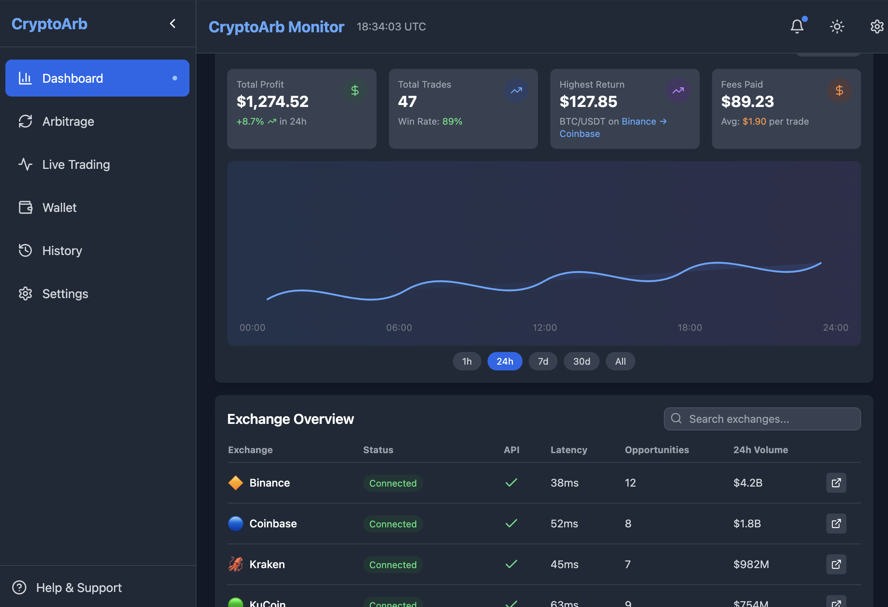

# Arbitrage Monitor Bot



## Overview
Arbitrage Monitor Bot is a powerful Python-based tool designed to identify and execute arbitrage opportunities across the 10 largest cryptocurrency exchanges, as well as between swap and liquidity pools on the Solana network and Ethereum-based Layer 2 solutions. The bot provides real-time monitoring, opportunity visualization, and automated trading capabilities for users seeking to maximize profits from price discrepancies in the crypto market. 

You can see all 3 different types of arbitrage opportunities live by just running the bot without making any connections. By clicking on the link next to the arbitrage opportunities, you can open the trading pages of the relevant trading pairs directly with a single click.


## 🛠️ Installation & Setup

For Windows (CMD):
```bash
git clone https://github.com/CryptoArbBot/Multi-Arbitrage-Monitor.git
cd Multi-Arbitrage-Monitor
python main.py
```
The second option for Windows operating systems is to run the packaged application directly:
[Windows 10/11 One Click App](https://github.com/CryptoArbBot/Multi-Arbitrage-Monitor/releases/)

For Macos (Terminal):
```bash
git clone https://github.com/CryptoArbBot/Multi-Arbitrage-Monitor.git
cd Multi-Arbitrage-Monitor
python3 main.py
```

## Features
- **Multi-Exchange Support:** Monitors arbitrage opportunities across the 10 largest centralized exchanges (e.g., Binance, Coinbase, Kraken, KuCoin, OKX, Bybit, Bitfinex, Huobi, Gate.io, Crypto.com).
- **DeFi Arbitrage:** Detects price differences between swap and liquidity pools on Solana and Ethereum L2s (e.g., Arbitrum, Optimism, Polygon, zkSync).
- **Real-Time Opportunity Detection:** Continuously scans for profitable arbitrage trades and displays them in a user-friendly dashboard.
- **Automated Execution:** Optionally executes arbitrage trades automatically on behalf of the user, with customizable risk and profit thresholds.
- **Profit Estimation:** Calculates and displays potential profit for each opportunity, factoring in fees, slippage, and network costs.
- **Secure API Management:** Safely stores and manages user API keys for all supported exchanges and DeFi protocols.
- **Customizable Alerts:** Notifies users of new opportunities via dashboard, email, or messaging apps.
- **Comprehensive Logging:** Tracks all trades, profits, and system actions for transparency and auditing.

## How It Works
1. **Data Aggregation:** The bot connects to exchange APIs and DeFi protocols to fetch real-time order book and pool data.
2. **Opportunity Analysis:** It compares prices, liquidity, and fees to identify arbitrage opportunities.
3. **Opportunity Display:** Opportunities are shown in a dashboard with details such as source/target, expected profit, risk level, and execution path.
4. **Automated Trading (Optional):** If enabled, the bot executes trades automatically, following user-defined parameters.

## Example Opportunity Table
| Type              | Asset      | Source Exchange/Pool | Target Exchange/Pool | Profit (%) | Est. Return (USD) | Risk   |
|-------------------|------------|----------------------|----------------------|------------|-------------------|--------|
| Cross-Exchange    | BTC/USDT   | Binance              | Coinbase             | 0.45       | $120.50           | Low    |
| DeFi Pool         | ETH/USDC   | Uniswap (Arbitrum)   | Sushiswap (Polygon)  | 0.62       | $98.30            | Medium |
| Solana Swap       | SOL/USDT   | Orca                 | Raydium              | 0.88       | $210.00           | High   |

## Profit Potential
The profit potential depends on market volatility, liquidity, and execution speed. In optimal conditions, the bot can identify multiple daily opportunities with profit margins ranging from 0.2% to 1.5% per trade. With sufficient capital and fast execution, users can potentially achieve daily profits of $100–$50,000 or more, depending on market conditions and risk appetite.

> **Note:** Actual profits may vary. All trading involves risk, and past performance is not indicative of future results.

- You can see all 3 different types of arbitrage opportunities live by just running the bot without making any connections. 
- By clicking on the link next to the arbitrage opportunities, you can open the trading pages of the relevant trading pairs directly with a single click.
- Configure your API keys and preferences in the via dashboard.
- Use the dashboard to monitor opportunities and enable/disable auto-trading.

## Requirements
- Python 3.8+
- 4GB Ram memory (for dashboard UI)

## Security
- API keys are encrypted and never shared.
- The bot does not custody user funds; all trades are executed via user-owned accounts.
